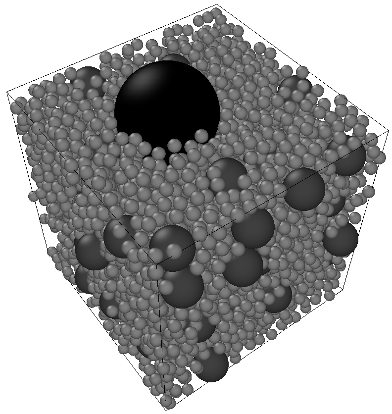

# Users' guide

See [https://marcjos.github.io/RSA_MPI/](https://marcjos.github.io/RSA_MPI/).

# RSA MPI Overview

RSA MPI is a HPC library dedicated to generating random configurations non-intersecting balls, with an unbiased the RSA algorithm.
The sequential strategy based on [Ebeida et al, 2012](https://onlinelibrary.wiley.com/doi/full/10.1111/j.1467-8659.2012.03059.x).
This strategy has been extended to the MPI framework, as decribed in this paper "Parallel and bias-free RSA algorithm for~maximal Poisson-sphere sampling, Josien & Prat (in preparation)".

Our implementation successfully generated more than 12 billions of spheres over 131,072 MPI processes in 16 seconds in dimension d=3.

# The RSA algorithm

This software provides an HPC implementation provably **equivalent** to the following classical RSA algorithm:
1. The desired radii of the spheres are sorted in nonincreasing order.
2. For each radius R, the following happens:
   - if no more sphere can be placed `break`,
   - a candidate sphere S of radius R is randomly chosen inside the global shape,
   - if S intersects an already placed sphere, then, go to the previous line. Otherwise, it is accepted.
3. The algorithm terminates if all the desired spheres has been placed, or if no more sphere can be placed (then, the configuration of spheres is guaranteed to be *packed*).

# Miscellaneous

- For the license, see the file LICENSE.
- Please kindly report bugs and issues through the gitlab interface. 
- If you use this software, please consider citing "Parallel and bias-free RSA algorithm for~maximal Poisson-sphere sampling, Josien & Prat (in preparation)".

