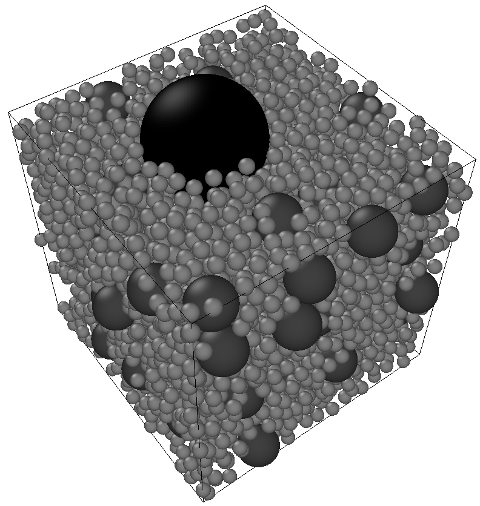

# RSA MPI Overview

RSA MPI is a HPC library dedicated to generating random configurations non-intersecting balls, with an unbiased the RSA algorithm.
The sequential strategy based on [Ebeida et al, 2012](https://onlinelibrary.wiley.com/doi/full/10.1111/j.1467-8659.2012.03059.x).
This strategy has been extended to the MPI framework, as decribed in this paper "Parallel and bias-free RSA algorithm for~maximal Poisson-sphere sampling, Josien & Prat (in preparation)".

Our implementation successfully generated more than 12 billions of spheres over 131,072 MPI processes in 16 seconds in dimension d=3.


<div align="center">

</div>

## The RSA algorithm


### Principle

This software provides an HPC implementation **equivalent** to the following classical RSA algorithm:
1. The desired radii of the spheres are sorted in nonincreasing order.
2. For each radius R, the following happens:
   - if no more sphere can be placed `break`,
   - a candidate sphere S of radius R is randomly chosen inside the global shape,
   - if S intersects an already placed sphere, then, go to the previous line. Otherwise, it is accepted.
3. The algorithm terminates if all the desired spheres has been placed, or if no more sphere can be placed (then, the configuration of spheres is guaranteed to be *packed*).

**Remark:** Although it provably provides the same output (in terms of statistics) as the above algorithm, this software uses a more educated strategy, see "Parallel and bias-free RSA algorithm for~maximal Poisson-sphere sampling, Josien & Prat (in preparation)".

### Special features

- **Inputs**
  - *Geometry* : The default geometry is a periodic cuboid, of prescribed lengths.
  - *Polydispersity* : There exist various ways to impose polydispersity. 
    - Impose an explicit list of radii as a final configuration.
    - Impose a list of radii $`r_1> ... > r_n`$, with prescribed volume fractions $`\phi_1, ..., \phi_n`$ as a final configuration.
- **Behaviour**:
  - *Packed configuration* : One can prescribe a list of radii $`r_1> ... > r_n`$, with prescribed volume fractions $`\phi_1, ..., \phi_n`$ as a final configuration. Three cases are possible:
    - All the volumes fractions $`\phi_j`$ for $`j\leq n`$ can be reached. Then, the algorithm *terminates normally*, and returns a message `End of generation, due to lack of new radii`.
    - All the volumes fractions $`\phi_j`$ for $`j<n`$ can be reached but the last $`\phi_n`$. Then, the algorithm *terminates normally*, and returns a message `End of algorithm : fully packed`. This guarantees that no more sphere of radius $`r\geq r_n`$ can be added. (To ensure a final packed configuration, impose $`\phi_n=1.0`$.)
    - At step $`j<n`$, it is not possible to place more spheres to reach the volume fraction $`\phi_j`$ with spheres of radius $`r_j`$. It leads to an **infinite loop** :warning:. (The reason is that the algorithm is not allowed to consider radii $`r_{j+1}`$ before reaching $`\phi_j`$.) To avoid this, consider *re-iterating*.
  - *Re-iterate* : Starting from a previous configuration, it is possible to add more spheres with different radius. For example, this may be used to get highly heterogenous and packed configurations of spheres of radii $`r_1 > ... > r_n`$, while guaranteeing at each step that the configuration is packed.
  - *Randomness* : The produced configurations are pseudo-random. Hence, we use a pseudo-random generator with a random seed. This guarantees the following behaviour: for a fixed number of MPI processes, and for a fixed seed value, the programm returns the same configuration. 
    - :warning: This guarantee is for a fixed machine, with a fixed software environment (compiler, MPI library, ...).
    - :warning: Changing the number of MPI processes changes the final configuration.
- **Outputs**
  - *Data* : List of spheres can be obtained directly in C++/python, on each MPI process.
  - *.vtk files* : .vtk files (read by [Paraview](https://www.paraview.org/)).


# Installation

:warning: These commands should be done in the root directory.

  1. Get pybind11
```
bash Installation/Pre-install.sh
```
  2. Building RSA MPI
```
bash Installation/Install.sh
```
  3. Testing
```
source Env.sh
cd build
ctest
cd ../
```
  4. Generate **doxygen** documentation (html in `./doc/')
```
cd include
doxygen DoxyDoc
cd ../
```

# Use

Source the environment.
```
source Env.sh
```
Then, three possibilities can be considered, depending on the complexity of the experiment:
- run with a command line in the standard case,
- use a python script for more refined use,
- build a C++ script for fine-tuned use.


## Command line

Command lines are available with the command:
```
rsa --help
```

Example of usage for 3D RSA with radius 0.05 inside a cube $`[0, 1]^3`$.
```
mpirun -n 4 rsa --dim 3 --radius 0.05 --seed 0 --size 10000 --inf 0, 0, 0 --sup 1, 1, 1 --paraview 1
```

## C++ script

Users may only make use of classes and functions of the namespace user_interface.
See the **doxygen** documentation for the C++ manual.  
Examples of script: 
- [main_script](scripts/main_script.cpp) : The simplest C++ script. **With comments.**
- [main_max_frac](scripts/main_max_frac.cpp) : Example of script using re-iteration.

## Using Python API

The Python API is actually a wrapper for the C++ API throught the [pybind11 library](https://github.com/pybind/pybind11/).
See the [python manual](doc/pythond_manual.md).  
For examples, see in [scripts_python](scripts_python), to be launched as:
```
mpiexec -np 2 python3 scripts_python/launch_rsa_mpi.py
```

# Miscellaneous

- For the license, see the file LICENSE.
- Please kindly report bugs and issues through the gitlab interface.
- If you use this software, please consider citing "Parallel and bias-free RSA algorithm for~maximal Poisson-sphere sampling, Josien & Prat (in preparation)".

