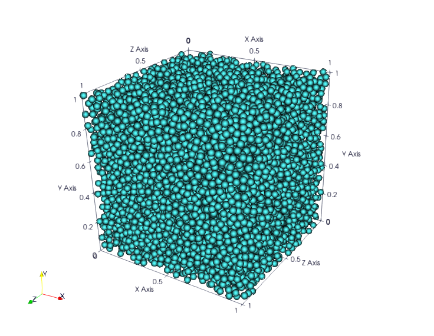
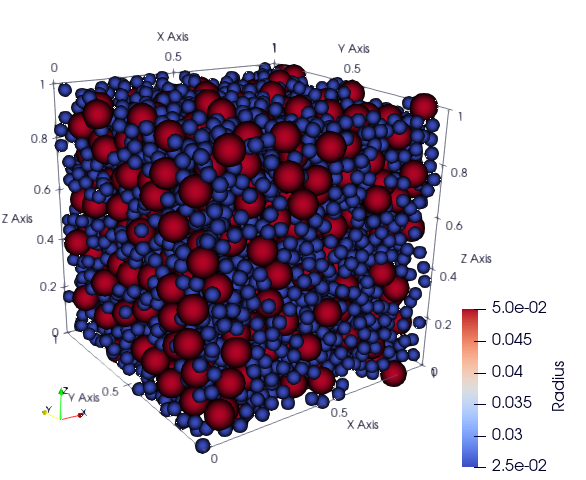
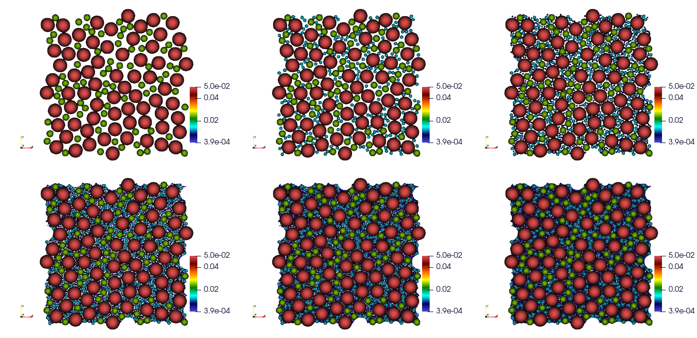
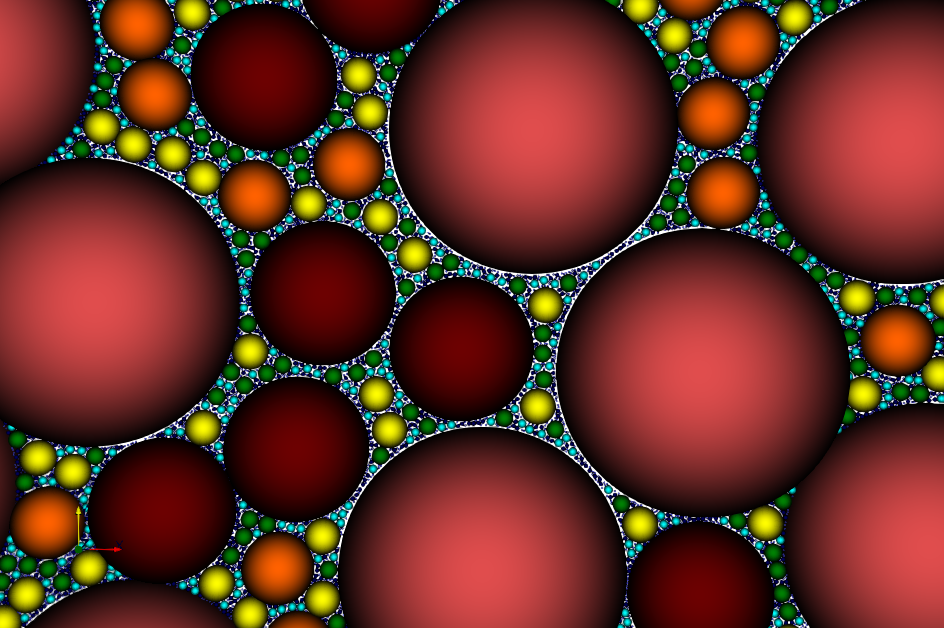

=============
RSA MPI Usage
=============

Source the environment
----------------------

.. code-block:: bash

   source Env.sh

Then, three possibilities can be considered, depending on the complexity
of the experiment: 

- run with a command line in the standard case, 
- use a python script for more refined use, 
- build a ``C++`` script for fine-tuned use.

RSA MPI Paramters
=================

Command lines
-------------

Command lines are available with the command:

.. code-block:: bash

   rsa --help

+------------+-----------------------+-----------------------------------------------------------------------------+
| Option     | Type                  | Description                                                                 |
+============+=======================+=============================================================================+
| --dim      | int, >= 2             | set dimension.                                                              |
+------------+-----------------------+-----------------------------------------------------------------------------+
| --radius   | [double]              | set sphere radius.                                                          |
+------------+-----------------------+-----------------------------------------------------------------------------+
| --seed     | [int]                 | set seed used to generate random numbers.                                   |
+------------+-----------------------+-----------------------------------------------------------------------------+
| --size     | [int]                 | set the maximum number of spheres thrown per dart.                          |
+------------+-----------------------+-----------------------------------------------------------------------------+
| --inf      | [double, ..., double] | set the position of the bottom limit of the simulation domain.              |
+------------+-----------------------+-----------------------------------------------------------------------------+
| --sup      | [double, ..., double] | set the position of the upper limit of the simulation domain.               |
+------------+-----------------------+-----------------------------------------------------------------------------+
| --paraview | int, 0 or 1           | disable [0] or activate [0] the feature: write paraview files, default is 0 |
+------------+-----------------------+-----------------------------------------------------------------------------+

Bash Example Run:
=================

Example of usage for 3D ``RSA`` with radius `0.02` inside a cube :math:`[0, 1]^3`.

.. code-block:: bash

   mpirun -n 4 rsa --dim 3 --radius 0.02 --seed 0 --size 10000 --inf 0, 0, 0 --sup 1, 1, 1 --paraview 1

Display your results:

.. code-block:: bash

  paraview ParaviewOutput/rsa_mpi_0.pvtp

C++ Script Example
==================

Users may only make use of classes and functions of the namespace user_interface. See the **doxygen** documentation for the C++ manual.

**Example of script: The  simplest ``C++`` script:** 

File:

.. code-block:: text
 
  scripts/main_script.cpp

Run:

.. code-block:: bash

  mpirun -n 10 /scripts/main_script

Output:

**Example of script: Example of script using re-iteration:** 

File:

.. code-block:: text

  scripts/main_max_frac.cpp

Run:

- Dim = 2
- First Radius = 0.05
- Box size = :math:`[0, 1]^3`
- Seed = 0
- Number of iteration = 7
- Radius Factor = 0.5

.. code-block:: 

  mpirun -n 10 scripts/reiterate_rsa 2 0.05 1 0 7 0.5

Outputs: 

Using Python API
================

The Python API is actually a wrapper for the ``C++`` API throught the `pybind11 library <https://github.com/pybind/pybind11/>`__. See the `python manual <doc/pythond_manual.md>`__. For examples, see in `scripts_python <scripts_python>`__, to be launched as:

.. code-block:: bash

   mpiexec -np 2 python3 scripts_python/launch_rsa_mpi.py

Miscellaneous
=============

-  For the license, see the file LICENSE.
-  Please kindly report bugs and issues through the gitlab interface.
-  If you use this software, please consider citing “Parallel and
   bias-free RSA algorithm for~maximal Poisson-sphere sampling, Josien &
   Prat (in preparation)”.
